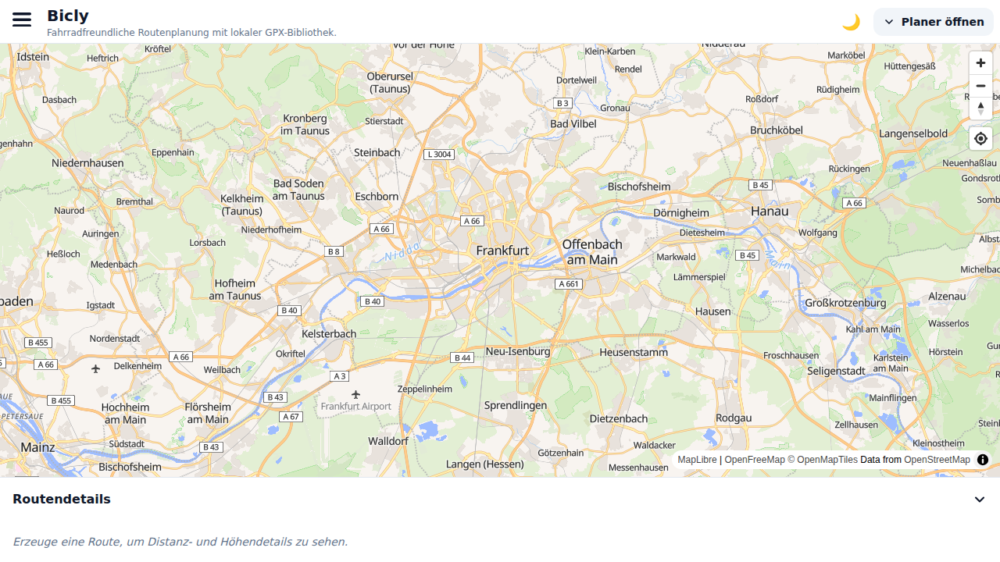
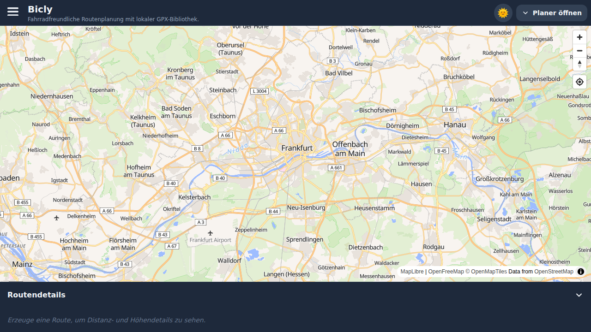
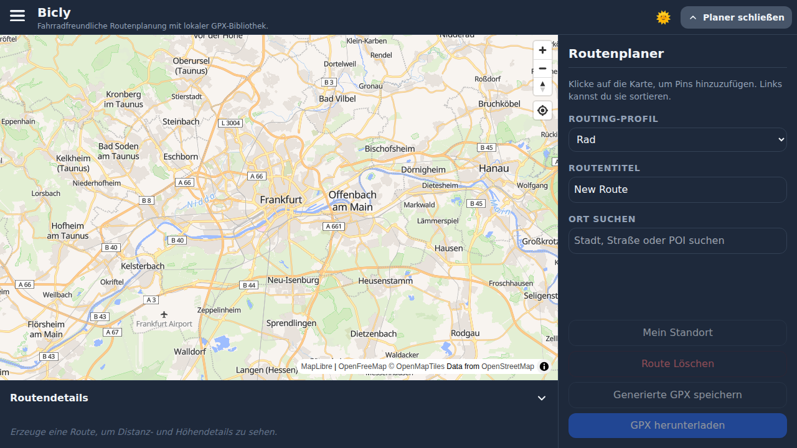
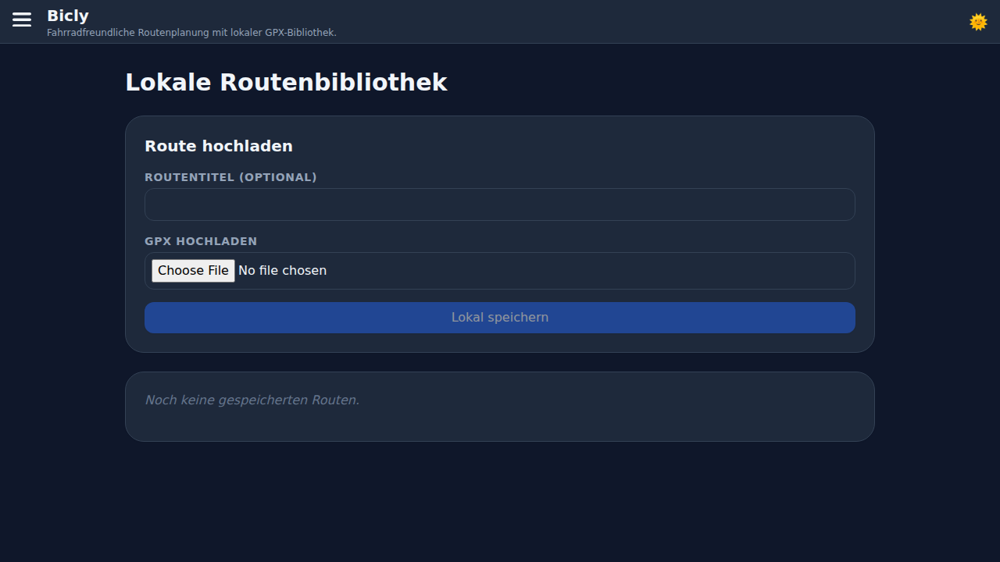
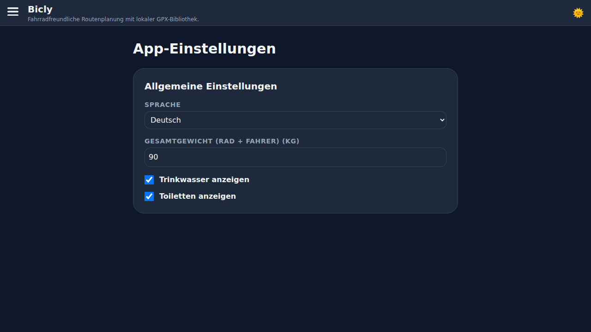

# Bicly

Bicly is a **Frontend-only** cycling app without login or backend.

## Stack

- **Frontend**: React + Vite + MapLibre GL
- **Routing**: Direct via public BRouter (`https://brouter.de/brouter`)
- **Geocoding**: Nominatim search
- **Storage**: Local browser storage (`localStorage`)

## Features

- Route planning with MapLibre and waypoints
- GPX generation via BRouter
- Save GPX locally (no account/login needed)
- Upload your own GPX files and manage them in your local library
- Load routes from your local library back onto the map

## Screenshots

### Planner (Light Mode)


### Planner (Dark Mode)


### Planner Sidebar


### Library


### Settings


## Start Locally

```bash
cd frontend
npm install
npm run dev -- --host 0.0.0.0 --port 5173
```

## Static Hosting

Bicly is a pure **Single Page Application (SPA)**. Since all API requests (routing, geocoding, map tiles) are sent directly from the browser to external CORS-enabled services, and data storage happens in `localStorage`, the app can be hosted on any static web server.

### Platforms
The app can be easily run on the following platforms (and many others):
- **GitHub Pages**
- **Vercel**
- **Netlify**
- **S3 / Cloudfront**

### Deployment (General)
1. Navigate to the `frontend` directory.
2. Run `npm install` and `npm run build`.
3. Upload the contents of the `dist` folder to your web server.

### Deployment on Vercel
1. Import the repository into Vercel.
2. Set the Root Directory to `frontend`.
3. Build Command: `npm run build`
4. Output Directory: `dist`

### BRouter Self-Hosting
The default API at `brouter.de` is primarily for testing. For production use, it is strongly recommended to run your own BRouter instance on a VPS or dedicated server.

**Hardware Requirements (for operation):**
- **Storage:** approx. **50 GB** for `.rd5` routing data for the entire world.
- **RAM:** At least **512 MB**.
- **CPU:** A single CPU core is sufficient.

### Environment Variables
- `VITE_BROUTER_DIRECT_URL`: Enter the URL of your own BRouter instance here (e.g., `https://your-server.com/brouter`). Default: `https://brouter.de/brouter`.
